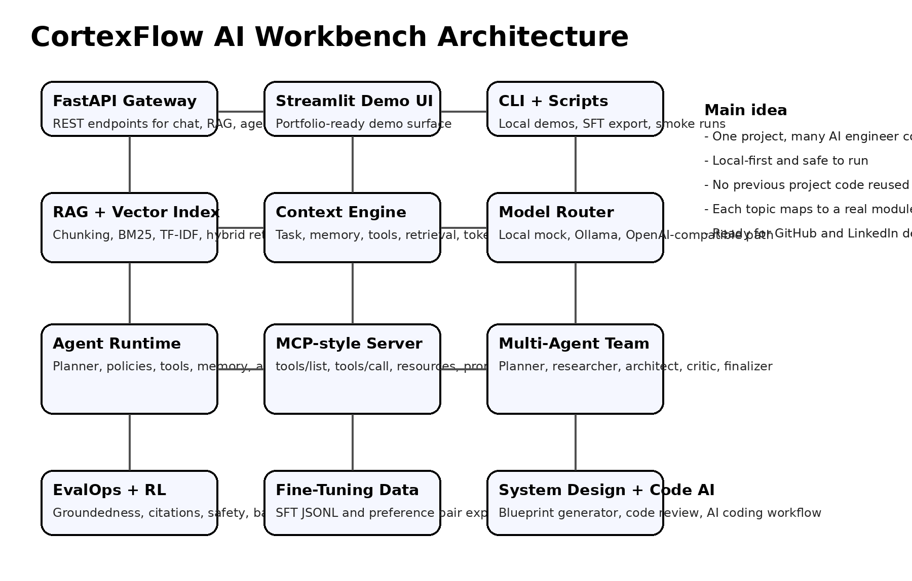

# CortexFlow AI Workbench

CortexFlow AI Workbench is a local-first AI engineering portfolio project that brings together the main skills expected from a modern GenAI engineer: RAG, vector search, context engineering, AI agents, MCP-style tool use, memory and state, multi-agent workflows, LLM evaluation, RL-style strategy tuning, computer-use planning, AI coding workflow, ML system design, and fine-tuning data preparation.

This is a fresh project built as a standalone portfolio repository. It does not reuse older portfolio project code. The goal is to show that AI engineering is not only prompt writing. A production AI application needs retrieval, context control, tools, policies, memory, evaluation, traces, APIs, UI, and deployment discipline.



## What problem this project solves

Many GenAI projects stop at a chatbot demo. CortexFlow is designed to show the next layer:

- How private knowledge is ingested, chunked, retrieved, and cited.
- How an agent decides when to search, calculate, design, create a ticket, review code, or plan browser actions.
- How tool execution can be controlled through schemas, policy checks, approval gates, and trace logs.
- How memory and session state make the app continuous instead of stateless.
- How MCP-style tools, resources, and prompts can be exposed to agents through a simple JSON-RPC interface.
- How answer quality can be measured through groundedness, citation coverage, token F1, safety, and latency.
- How feedback can tune retrieval strategy through a simple reinforcement-learning style bandit.
- How interaction traces can be exported into SFT or preference datasets for later fine-tuning.

## Main features

| Area | What is implemented |
|---|---|
| AI Chat Assistant | Chat endpoint with session memory, optional RAG, model router, and trace id |
| Knowledge Q&A | Local document ingestion, chunking, hybrid retrieval, citations, and answer generation |
| Vector Database 101 | Pure Python local index with keyword, BM25, TF-IDF cosine, and hybrid ranking |
| RAG | Retrieval, context assembly, grounded answer generation, source tracking, eval dataset |
| Context Engineering | Context builder that combines user goal, retrieved evidence, memory, and tool traces |
| AI Agents | Planner, tool registry, policy gate, executor, memory update, reflection, final answer |
| Agentic Patterns | Router, ReAct-style tool loop, planner-executor, evaluator-optimizer, multi-agent debate mapping |
| MCP | Local JSON-RPC server for initialize, tools/list, tools/call, resources/list, resources/read, prompts/list, prompts/get |
| Multi-Agent Architecture | Planner, researcher, architect, critic, and finalizer roles working on the same objective |
| Memory and State | Session memory, long-term facts, versioned events, search over user memory |
| LLM Evals | Token F1, groundedness, expected term recall, citation coverage, safety, latency |
| RL Concepts | Epsilon-greedy bandit for retrieval strategy selection and reward updates |
| AI Coding Workflow | Planning and review helper for scope, tests, implementation, and review loop |
| Computer Use | Safe simulated browser/computer action planning with approval for risky actions |
| ML System Design | Blueprint generator for data, serving, evaluation, safety, risks, and first milestone |
| Fine-Tuning Prep | SFT JSONL and preference-pair export from RAG traces |
| Local LLMs | Default local deterministic model plus optional Ollama and OpenAI-compatible routing |
| Deployment | FastAPI backend, Streamlit UI, Dockerfile, docker-compose, Makefile, tests |

## Folder structure

```text
cortexflow-ai-workbench/
  app/
    api/                 FastAPI routes
    agents/              Planner, patterns, policy gate, tools, runner, multi-agent, computer-use planner
    coding/              AI coding workflow helper
    context/             Context engineering layer
    core/                Config and schemas
    evals/               LLM and RAG evaluation metrics
    llm/                 Local, Ollama, and OpenAI-compatible model router
    mcp/                 Local MCP-style server and client
    memory/              Session and long-term memory
    rag/                 Chunking, vector index, retrieval, RAG pipeline
    rl/                  Retrieval strategy bandit
    storage/             JSON storage helpers
    system_design/       AI/ML system design blueprint generator
    training/            SFT and preference dataset exporter
  data/
    sample_docs/         Built-in knowledge base docs
    eval_sets/           Example evaluation dataset
    runtime/             Local generated traces and state
  docs/                  Architecture, coverage, walkthrough, LinkedIn and GitHub content
  scripts/               Smoke demo and dataset export script
  tests/                 Pytest tests
  ui/                    Streamlit demo app
```

## Quick start

```bash
python -m venv .venv
source .venv/bin/activate
pip install -r requirements.txt
pytest -q
uvicorn app.main:app --reload
```

Open the API docs at:

```text
http://localhost:8000/docs
```

Run the Streamlit UI:

```bash
streamlit run ui/streamlit_app.py
```

Open the UI at:

```text
http://localhost:8501
```

Run the all-in-one smoke demo:

```bash
python scripts/smoke_demo.py
```

## API examples

### Ask the RAG system

```bash
curl -X POST http://localhost:8000/rag/query \
  -H "Content-Type: application/json" \
  -d '{"question":"How should RAG be evaluated?","strategy":"hybrid","top_k":5}'
```

### Run an agent workflow

```bash
curl -X POST http://localhost:8000/agent/run \
  -H "Content-Type: application/json" \
  -d '{"goal":"Design a safe support agent with MCP tools and evaluation","approved":false}'
```

### List MCP-style tools

```bash
curl -X POST http://localhost:8000/mcp \
  -H "Content-Type: application/json" \
  -d '{"jsonrpc":"2.0","id":"1","method":"tools/list","params":{}}'
```

### Run EvalOps

```bash
curl -X POST http://localhost:8000/eval/run
```

### Export SFT dataset from traces

```bash
python scripts/export_sft_dataset.py --path data/runtime/sft.jsonl --mode sft
```

## How the RAG system works

The RAG pipeline follows this flow:

1. Load documents from `data/sample_docs` or through `/ingest`.
2. Split each document into overlapping chunks.
3. Store chunks in local JSON storage.
4. Build an in-memory sparse index.
5. Search with keyword, BM25, TF-IDF cosine, or hybrid strategy.
6. Apply simple visibility and owner filtering before returning context.
7. Send retrieved context to the model router.
8. Return an answer with citations and metrics.
9. Save traces for evaluation and fine-tuning dataset export.

The project uses a pure Python local vector index so the code is easy to read and run without external vector DB setup. In a production version, this layer can be swapped with Qdrant, Weaviate, Milvus, pgvector, Pinecone, Elasticsearch, or OpenSearch.

## How the agent works

The agent runtime is intentionally simple and explainable:

1. The planner reads the user goal and selects tool calls.
2. The policy gate checks whether a tool is risky.
3. The executor runs approved tools through the registry.
4. Memory stores user and assistant events.
5. The context engine combines goal, memory, retrieved evidence, and tool traces.
6. The model router produces the final answer.
7. A reflection step checks whether retrieval and evaluation were included.

This structure demonstrates the real production concern: the model can suggest actions, but backend policy decides what actually runs.

## MCP-style interface

CortexFlow includes a local JSON-RPC server with methods inspired by MCP-style workflows:

| Method | Purpose |
|---|---|
| initialize | Returns server name, version, and capabilities |
| tools/list | Lists available tools and schemas |
| tools/call | Calls a registered tool with structured arguments |
| resources/list | Lists knowledge-base resources |
| resources/read | Reads a knowledge-base resource |
| prompts/list | Lists reusable prompts |
| prompts/get | Returns a safe agent prompt |

This gives a clean way to explain MCP in interviews: AI apps need a standard contract for tools, resources, and prompts instead of custom one-off integrations.

## Evaluation design

CortexFlow evaluates generated answers using simple transparent metrics:

| Metric | What it checks |
|---|---|
| Expected term recall | Whether important expected terms appear in the answer |
| Token F1 | Overlap between generated answer and reference answer |
| Groundedness | How much of the answer is supported by retrieved context tokens |
| Citation coverage | Whether answer references returned chunks |
| Safety score | Whether risky terms appear in the answer |
| Latency | How long the RAG call took |

The evaluation runner reads `data/eval_sets/rag_eval.json` and returns row-level scores plus an overall score.

## Why this project is good for a GenAI engineer portfolio

It covers the current practical skill stack expected from AI engineers:

- Build a working LLM application, not only notebooks.
- Explain RAG, vector search, and chunking with real code.
- Show agent tool execution with policy checks.
- Demonstrate MCP-style tool interfaces.
- Use memory and state deliberately.
- Build multi-agent workflows without hiding coordination complexity.
- Measure answers instead of manually eyeballing outputs.
- Export traces for future fine-tuning.
- Provide API, UI, tests, Docker, docs, and a demo story.

## Suggested LinkedIn demo flow

1. Start FastAPI and Streamlit.
2. Open the RAG tab and ask: `How should RAG be evaluated?`
3. Show citations and metrics.
4. Open Agent tab and run: `Design a safe support agent with MCP tools and evaluation`.
5. Show tool trace, policy behavior, and final answer.
6. Open EvalOps tab and show score table.
7. Open MCP Tools tab and show tools/list.
8. End with the architecture diagram and explain why AI engineering is now system engineering around LLMs.

## Environment modes

By default, CortexFlow uses a deterministic local model so the project can run without paid APIs.

Set this for Ollama:

```bash
CORTEXFLOW_MODEL_PROVIDER=ollama
OLLAMA_MODEL=llama3.1
```

Set this for OpenAI-compatible usage:

```bash
CORTEXFLOW_MODEL_PROVIDER=openai
OPENAI_API_KEY=your_key
OPENAI_MODEL=gpt-4o-mini
```

## Test command

```bash
pytest -q
```

The tests cover retrieval, agent execution, MCP tool listing, evaluation metrics, retrieval bandit updates, and fine-tuning dataset creation.

## Project positioning

One-line version:

> CortexFlow is a local-first AI engineering workbench that turns GenAI concepts into a testable system with RAG, agents, MCP-style tools, memory, multi-agent workflows, EvalOps, RL strategy tuning, and fine-tuning data export.

Interview version:

> I built CortexFlow to show that modern AI engineering is not just calling an LLM. It requires reliable retrieval, structured context, safe tool execution, state management, evaluation, and deployment. The project is intentionally local-first so anyone can inspect the architecture, run tests, and understand each part.
